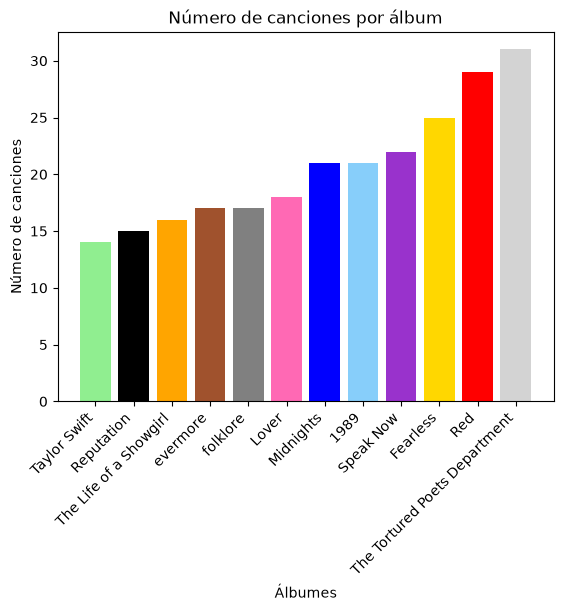

# Taylor Swift Análisis de Canciones

### Dataset

Se elaboró un [dataset](data/Taylor_Swift_Data.xlsx) de la canciones de Taylor Swift, para esto se tomaron la versiones deluxe de todos los álbumes cuando se tuvieron disponible y se usó los Taylor's version a excepción cuando no existía se usaba el álbum original. En el dataset, se incluyen los siguientes campos: 
- **Album**: Nombre del álbum. Tipo str
- **Track Number**: Número de track dentro del álbum. Tipo init
- **Taylor Version**: Si la canción es Taylor's Version. Tipo Booleano
- **Song Name**: Nombre de la canción. Tipo str
- **Duration (s)**: Duración de la canción en segundos. Tipo int
- **From The Vault**: Indica si la canción es del vault. Tipo Booleano
- **Lyrics**: Letra de la canción en inglés (idioma original). Tipo str. 
----

### Análisis

<!--! [Imagen](images/n_canciones_por_album.png) -->

  

