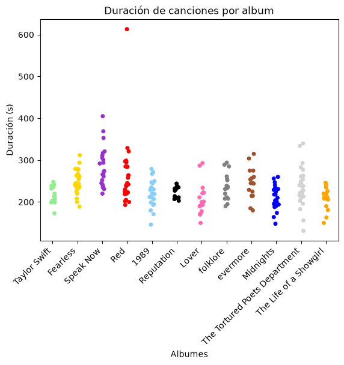
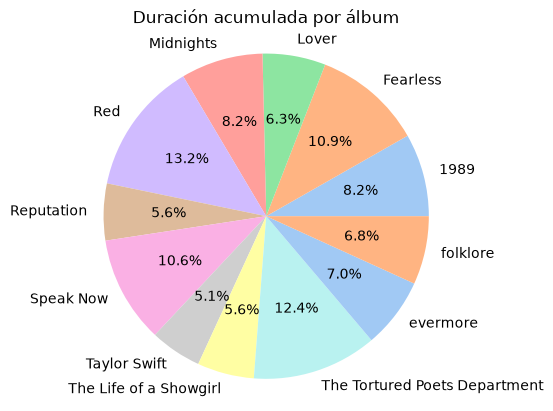
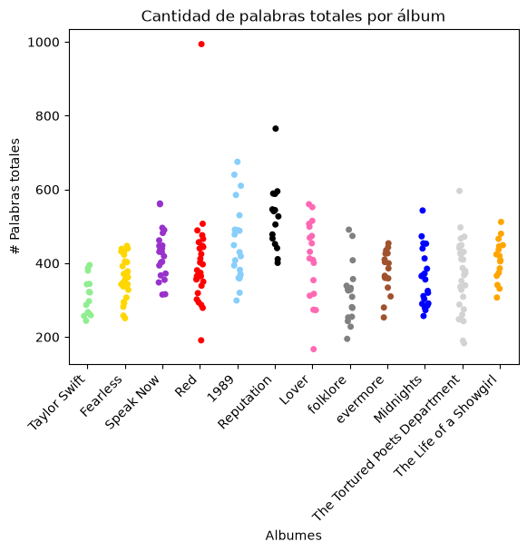
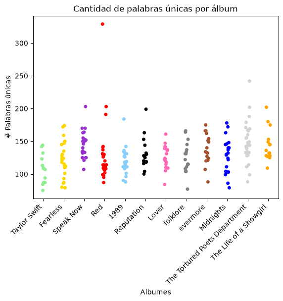

# Taylor Swift Análisis de Canciones


### Dataset

Se elaboró un [dataset](data/Taylor_Swift_Data.xlsx) de las canciones de Taylor Swift. Para esto, se tomaron las versiones deluxe de todos los álbumes cuando estuvieron disponibles y se usaron las Taylor's Version; a excepción de cuando no existía, se usaba el álbum original. Se considera hasta el álbum **"The Life of a Showgirl: Encore"**

En el dataset, se incluyen los siguientes campos: 
- **Album**: Nombre del álbum. Tipo str
- **Track Number**: Número de track dentro del álbum. Tipo init
- **Taylor Version**: Si la canción es Taylor's Version. Tipo Booleano
- **Song Name**: Nombre de la canción. Tipo str
- **Duration (s)**: Duración de la canción en segundos. Tipo int
- **From The Vault**: Indica si la canción es del vault. Tipo Booleano
- **Lyrics**: Letra de la canción en inglés (idioma original). Tipo str. 
----

### Análisis

Se hizo análisis el cual puede ser categorizado por los siguientes tipos:
- Por número de canciones por álbum
- Por duración de canción y álbum
- Por cantidad palabras (únicas y totales)
- Por el sentimiento de las letras de canciones (NLP)
----

### Resultados
<!--! [Imagen](images/n_canciones_por_album.png) -->

**1) Número de canciones por álbum:**

Se realizó un gráfico de barras el cual muestra la cantidad total de canciones por álbum. Se aprecia que el de mayor canciones es *The Tortured Poets Department* y el menor, *Taylor Swift (Debut)*
<div align="center">
  
</div>

**2) Duración de canciones y álbum:**

Inicialmente, se calcularon la canción de mayor, menor y la duración promedio:
```
Canción de mayor duración: All Too Well (10 Minute Version)
10m 13s
Canción de menor duración: I Look in People's Windows
2m 11s
Tiempo promedio de canciones
3.0m 55.5s
```
Se realizó lo mismo para los álbumes
```
Album de mayor duración: Red
130m 26s
Número de canciones:  30
Album de menor duración:  Taylor Swift
50m 27s
Número de canciones:  14
```
Después, se realizó un gráfico de dispersión de la duración de las canciones por cada álbum. Las canciones tienen una duración similar entre sí, con excepción del álbum **Red**, en el cual la canción *All Too Well (10 Minute Version)* resalta debido a su extensión. 

<div align="center">
  
</div>
Adicionalmente, se realizó un gráfico de torta de la duración total de cada álbum. Se calculó la duración total en segundos: 

<div align="center">
  
</div>

```
Album
1989                             4868
Fearless                         6422
Lover                            3705
Midnights                        4824
Red                              7826
Reputation                       3338
Speak Now                        6273
Taylor Swift                     3027
The Life of a Showgirl           3340
The Tortured Poets Department    7341
evermore                         4137
folklore                         4019
```


**3) Palabras**

Para este se analizaron las palabras totales por cada canción, esto fue dividido entre palabras totales y únicas. 

- PALABRAS TOTALES

```
Mayor número de palabras: 994
Canción: All Too Well (10 Minute Version)
Menor número de palabras: 167
Canción: It's Nice to Have a Friend
```

- PALABRAS ÚNICAS
```
Mayor número de palabras: 329
Canción: All Too Well (10 Minute Version)
Menor número de palabras: 75
Canción: A Perfectly Good Heart
```
  
<p align="center">
  
  
</p>
